# Arcade Pico - An Alternative Switch/Lamp Holder for Arcade Buttons
[点这里可以切换到中文版](README_CN.md)

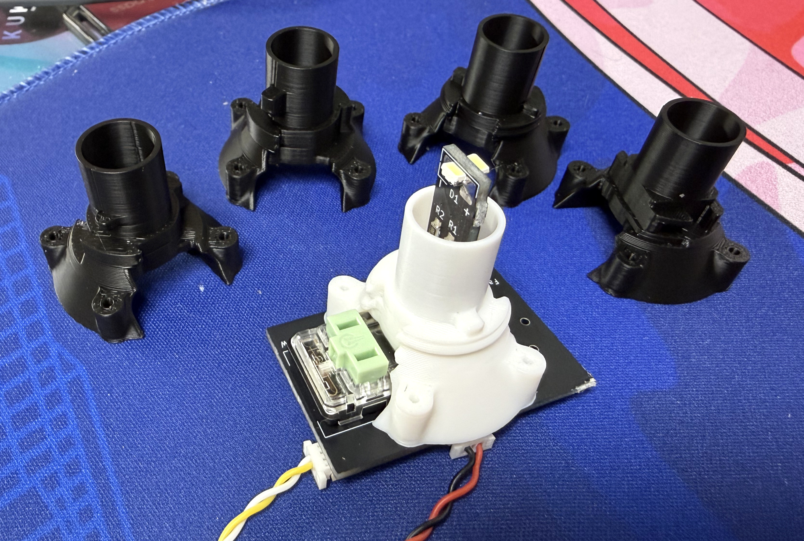

It's the successor to my sanwa_opt project. With it, you can use regular low-profile keyboard switches (or even optical sensors) on arcade buttons.

## Features
* Compatible with both old Sanwa (push-click) and new Sanwa (twist-lock), Samducksa, and common Chinese buttons;
* Supports mechanical switches, optical sensors, and magnetic switches (`IO Board` required);
* Mechanical switch can be hotswap (Kailh Choc sockets);
* Feel switch and actuation switch can be separated;
* RGB LED support (`IO Board` required);
* FDM 3D-printing friendly.
* Multiple connection options to fit different systems.

## Thanks
Thanks to many respectful guys/companies who made their tools or materials free or open source (KiCad, OnShape, InkScape, Raspberry things).

Special thanks to community projects and developers.
And also these projects:
* RP_Silicon_KiCad: https://github.com/HeadBoffin/RP_Silicon_KiCad

## My Other Projects
You can check out my other cool projects.

                

* Popn Pico: https://github.com/whowechina/popn_pico
* IIDX Pico: https://github.com/whowechina/iidx_pico
* IIDX Teeny: https://github.com/whowechina/iidx_teeny
* Chu Pico: https://github.com/whowechina/chu_pico
* Mai Pico: https://github.com/whowechina/mai_pico
* Diva Pico: https://github.com/whowechina/diva_pico
* AIC Pico: https://github.com/whowechina/aic_pico
* Groove Pico: https://github.com/whowechina/groove_pico
* Geki Pico: https://github.com/whowechina/geki_pico
* Musec Pico: https://github.com/whowechina/musec_pico
* Ju Pico: https://github.com/whowechina/ju_pico
* Bishi Pico: https://github.com/whowechina/bishi_pico
* Nos Pico: https://github.com/whowechina/nos_pico
* Voltex Pico: https://github.com/whowechina/voltex_pico
* Chord Pico: https://github.com/whowechina/chord_pico
* Arcade Pico: https://github.com/whowechina/arcade_pico

## **Disclaimer** ##
I made this project in my personal time with no financial benefit or sponsorship. I will continue to improve the project. I have done my best to ensure that everything is accurate and functional, there's always a chance that mistakes may occur. I cannot be held responsible for any loss of your time or money that may result from using this open source project. Thank you for your understanding.

## About the License
It's CC-NC. So DIY for yourself and for your friend, don't make money from it. And plagiarism that doesn’t even dare to mention the original author is not acceptable. Please note that pooling orders and group buying for raw materials is acceptable.Selling any leftover components at cost (without profit) is also acceptable.

If you're interested in buying from me, or for commercial use, please contact me (Discord, QQ group, Goofish).
* My Discord Invitation: https://discord.gg/M8f2PPQFEA
* QQ Group: 854535476
* Goofish: whowe12345

## Use Cases
### Terminology First
* **`Button Board`** - The PCB that contains the switch and LED daughter board. It's the major part of the Arcade Pico project.
* **`IO Board`** - The optional PCB that converts Hall effect switch signals to digital signals, and bridges regular LED signals to WS2812B RGB LED data signals. It's also part of the Arcade Pico project.
* **`Main Board`** - The original controller board of your arcade system.

### Case: Replace the Lamp/Switch Holder without the `IO Board`
It's the most common and easy case. The only thing you need to do is wiring the switch and LED signals from your `Main Board` to the corresponding connectors on the `Button Board`.
You can use mechanical switches or optical sensors, but you can't use magnetic switches or RGB lights.

#### Wiring:
* **SW Out** (SH1.0 3P) on `Button Board` → **Button Input** on `Main Board`
* **LED In** (SH1.0 3P) on `Button Board` ← **Lamp Output** on `Main Board`

### Case: Enjoy the Magnetic Switch or the RGB light with the `IO Board`
With magnetic switch, you can define your trigger and reset distance. With RGB light, you can define your button light color and effect. `IO Board` is required to drive the magnetic switch and RGB light.

#### Wiring:
* Magnetic switch signals
  * **SW Out** (SH1.0 3P) on `Button Board` → **Hall In** (SH1.0 3P) on `IO Board`
  * **Out** (XH2.5 2P) on `IO Board` → **Button Input** on `Main Board`
* RGB LED signals
  * **Lamp Output** on `Main Board` → **Lamp In** (XH2.5 2P) on `IO Board`
  * **LED Out** (SH1.0 3P) on `IO Board` → **LED In** (SH1.0 3P) on `Button Board`
  * **LED Out** (SH1.0 3P) on `Button Board` → **LED In** (SH1.0 3P) on next `Button Board` (if any)
  * **LED Out** (SH1.0 3P) on last `Button Board` → **LED End** (SH1.0 3P) on `IO Board` for power backup.

* You can power the `IO Board` from the `Main Board`'s 5V supply via JST 2P, or directly via Type-C port (USB or power adapter).

#### When `IO Board` is connected to a host computer via Type-C:
  * `IO Board` works as an HID device.  
    So if you're fine with this extra USB cable, you might be able to skip the wiring between the `IO Board` and the `Main Board`. However, some games require the controller to be a single device, so this won't work in those cases.
  * CLI (command line interface) is on USB CDC (serial).
  * The Type-C port is also for firmware update.

### Imagined Case: Interfacing with DJDao PhoenixWAN
This is a theoretical case that probably won't be implemented. If implemented, all that cockamamie wiring between `IO Board` and `Main Board` would be eliminated - they'd simply communicate via UART.

Let's hope this happens someday.

# How to Build
## The Button Board
### Common Part
* The PCB gerber file is `Production/PCB/"arcade_pico_button_*.zip`. The one with `socket` is hotswap (for Choc V1 and V2). I always use JLC (https://www.jlcpcb.com) and Jiepei (https://www.jiepei.com), feel free to use your preferred PCB manufacturer. They may ask if you need half-hole pads for the `Button Board`, just answer "No", it's costy and not necessary.
* 2X 3P SH1.0 horizontal SMD connector on "SW" and "LED In" footprints.
* 1X 3P SH1.0 horizontal SMD connector on "LED Out" footprint, only needed when using WS2812B RGB LED daughter board.

* To connect LEDs:
  * "LED In" connector (+, -) is for regular single color LED signal from your existing `Main Board`.
  * "LED In" and "LED Out" connectors are for daisy-chain when using WS2812B RGB LED daughter board.

### Mechanical Switch
* Use either SW1 or SW2 footprint for Kailh Choc V1/V2 switches.
* Use Kailh Choc low-profile hotswap socket if you choose hotswap PCB version.  
  https://kailhswitch.net/products/kailh-mechnical-keyboard-switches-hot-swap-pcb-socket-diy-for-1350-choc-low-profile-keyboard-switches
* Short the corresponding jumper (sw1 or sw2) to enable the switch.
* You can solder the other switch, but it's only for the feel, so don't short the jumper.

* To connect to controller's `Main Board`:
  * "SW" connector (Out, GND) is for the switch signal;

* This example shows SW1 as the trigger switch, and optional Choc V1 on SW2 is just for the feel.  
  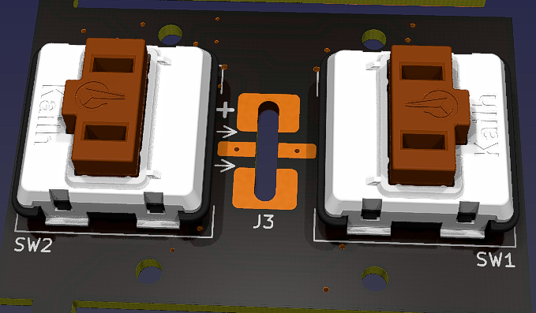 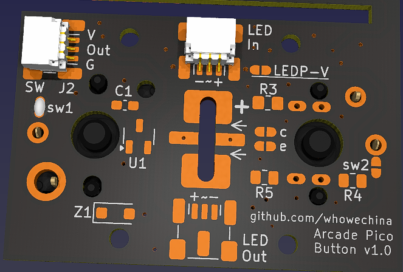

### Optical Sensor
* Solder the IR diode (IR908-7C) and phototransistor (PT908-7C) at proper height;
* Solder R3 (500 ohm for 3.3V supply, 1k ohm for 5V supply);
* Resistors: R4, R5; Jumpers: c, e; Zener: Z1.
  * Low-active logic (most systems are): R4 (0-10 ohm), R5 (2k ohm), short the jumper c by soldering.
  * High-active logic: R4 (2k ohm), R5 (0-10 ohm), short the jumper e.
  * When power supply is 5V but the target system IO is 3.3V, solder Z1 (3.3V SOD-123F Zener diode) to protect the IO pin.
* You can solder a mechanical switch on SW1 footprint for some tactile feel, but don't short the jumper sw1.
* On some systems, one LED line is a constant 5V or 3.3V power supply, you can borrow that to power the optical sensor - just short the jumper "LEDP-V".

* To connect to controller's `Main Board`:
  * "SW" connector (V, Out, GND) is for the switch signal;

* This example shows a low-active configuration, 5V is borrowed from LED positive line, and optional Choc V1 on SW1 just for the feel.  
  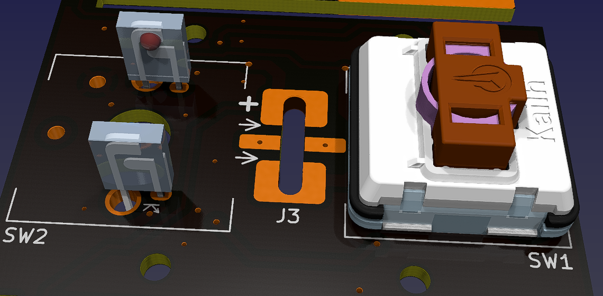 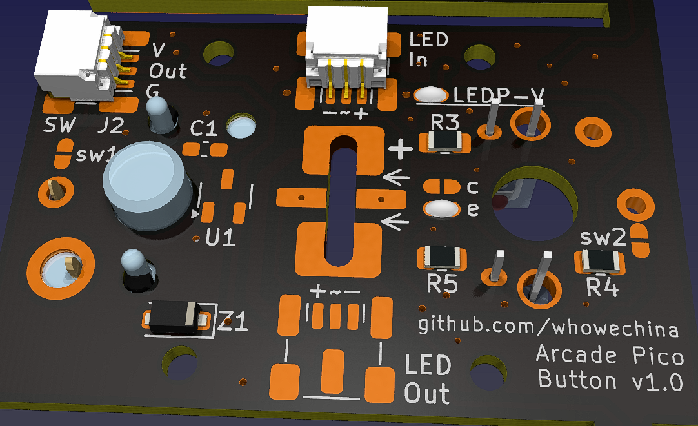

### Magnetic (Hall Effect) Switch
* Solder U1 (SS49E SOT23-3) and C1 (0.1uF 0603).
* You can solder a mechanical switch on SW2 footprint for some tactile feel, but don't solder the jumper sw2.
* If the Hall effect switch is not mounted tightly, you may need to use some RTV silicone adhesive to secure it.

* This example uses Hall effect switch on SW2 and optional Choc V1 on SW1 just for the feel.  
  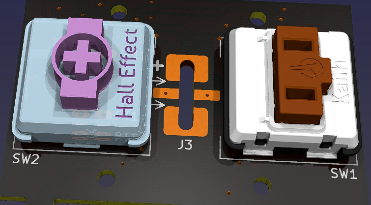 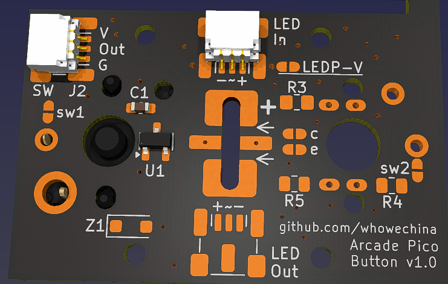

* To connect to controller's `Main Board`:
* "SW" connector (V, Out, G) connects to the **Arcade Pico IO** board. Then the `IO Board` connects to the `Main Board`.

* Note that Arcade Pico `IO Board` is need for this setup.

## The LED Daughter Board
* It is separated from the **Arcade Pico Button** board by snapping or cutting. There're two versions: single-color LED and WS2812B RGB LED. You can choose either one according to your needs.
* After soldering the components, insert the LED daughter board back to the button PCB vertically from the top side. Solder one pin first, so you'll have a chance to adjust the height.
* If it's too low or too high, you won't get even illumination. You can measure the height from your old lamp holder. From my experience with Sanwa, distance from the LED top to the PCB surface is about 37mm.
* When you finish adjusting the height, solder all pins to secure the connection.  
 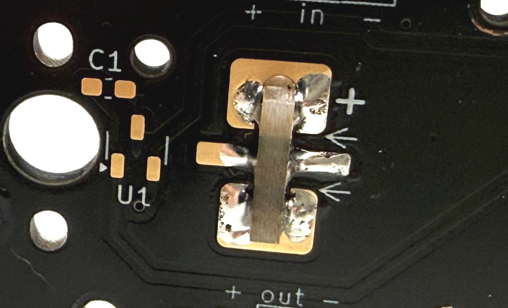

### Single-color LED Board
* Use high-brightness side emitting LEDs. The footprint is compatible with various packages, such as SMD 4008, SMD 4020, SMD 3014, or even through-hole ones (ones with concave lens are better).
* If you're using SMD LEDs, you can use two of them, one for each side, to get better light distribution.
* They're normally rated for 20mA current. So typically you use 100-220 ohm current resistors (R1 and R2) for 5V supply, or 50-100 ohm for 3.3V supply.
* Here's how it looks after soldered.  
  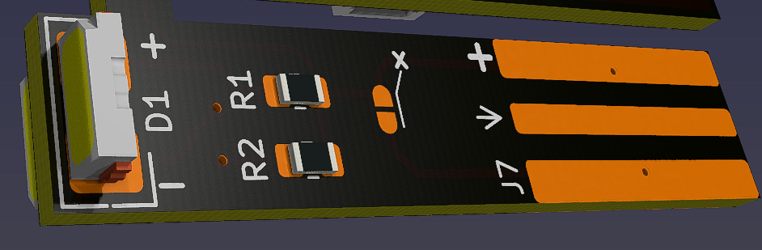 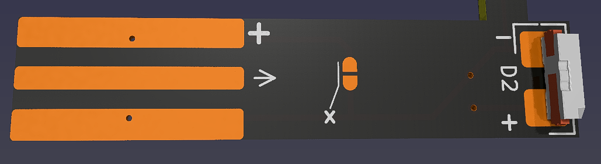 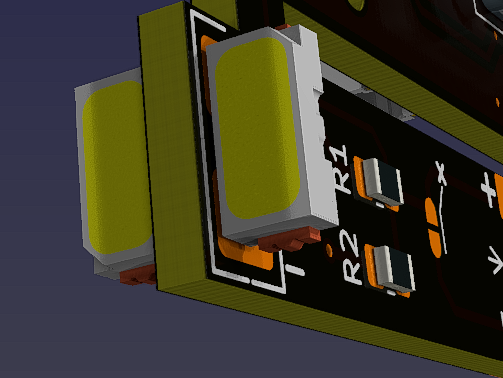
* If the polarity of the LED footprint doesn't match your LED, just cut/break the trace right at the "x" mark at **both sides**, and short the jumpers accordingly. This will reverse the polarity.  
  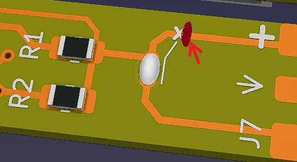

### WS2812B RGB LED Board
* **Arcade Pico `IO Board` is required.**
* Use WS2812B 4020 side emitting RGB LEDs. You can use two of them, one for each side, to get better light distribution.
* 0.1uF 0805 or 0603 capacitor on C2 footprint is highly recommended.
* Here's how it looks after soldered.  
   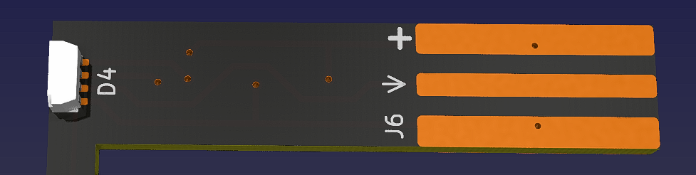 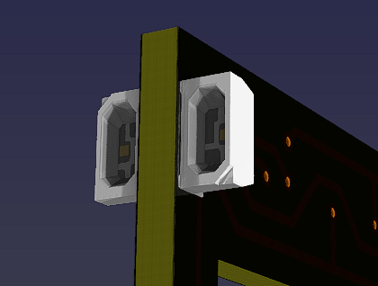

## The `IO Board`
* The `IO Board` can convert the analog signals from Hall effect switches into digital signals for your main controller board. It can also bridge traditional LED bulb signals to WS2812B RGB LED data signals.
* If you don't need one or both of these functions, just skip the corresponding components.

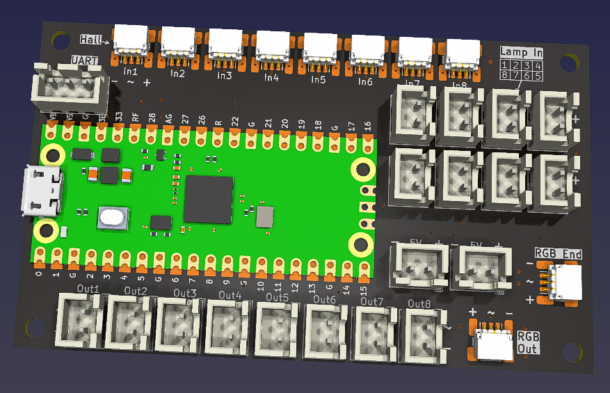 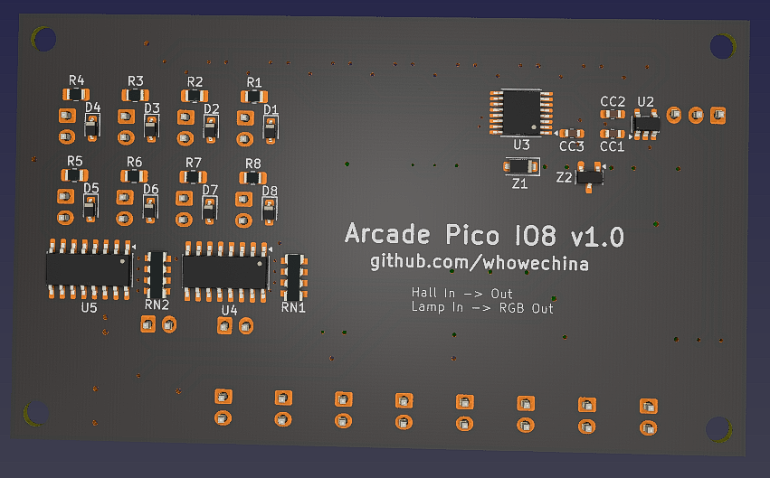

### Common Parts
* 1x Raspberry Pi Pico.  
  https://www.raspberrypi.com/products/raspberry-pi-pico
* 2x 2P JST XH2.54 or XH2.5 vertical connectors, for 5V power input.
* 1x 3P JST XH2.54 or XH2.5 vertical connector for UART, optional for future use.

### Components for Hall Effect Switch
* 1x ADG708BRUZ, 8 to 1 analog switch, in TSSOP-16 (U3).
* 1x LP5907MFX-4.5 or TPS7A2042PDBVR LDO, in SOT23-5 (U2), see next line.
* 1x LM4040 shunt voltage reference in SOT23-3 (Z2), 2.0~2.1V (for 4.2V LDO) or 2.2~2.5V (for 4.5V LDO).
* 1x 3.3V Zener diode, in SOD-123 or SOD-123F, such as BZT52H-C3V3 (Z1).
* 3x 0.1uF 0603 capacitors (CC1, CC2, CC3).
* 8x 3P SH1.0 horizontal SMD connectors (In1~In8), for connecting up to 8 Hall effect `Button Board`s.
* 8x 2P JST XH2.54 or XH2.5 vertical connectors (Out1~Out8), for connecting to the main controller board.

### Components for RGB LED
* 8x 220ohm 0603 resistors (R1~R8), for optical isolator current limiting. If your light is 12V, use 1kohm 0805 resistors instead.
* 8x 1N4148 SOD-323 diodes (D1~D8), to protect from reverse voltage, only needed for 12V light input.
* 2X PC847 or compatible quad optical isolators (U4, U5), in SOP-16.
* 2x 0805 x 4 5.1K 8P4R resistor arrays (RN1, RN2), if they're not available, use 8x individual 5.1K 0603 resistors instead.
* 2x 3P SH1.0 horizontal SMD connectors (LED Out and LED End), to connect to the `Button Board` equipped with WS2812B RGB LED daughter board.
* 8x 2P JST XH2.54 or XH2.5 vertical connectors (Lamp In 1~8), for connecting to the main controller board's LED signal.

## Notes on PCB and Electronics
### Things You May **Need** to Tinker with
* Here's how you calculate the LED current limiter, it also applies to the IR emitter diode of the optical isolator:
  * R = (V_supply - V_F) / I
  * V_F for single color LED is usually around 3V, V_F for IR emitter is usually around 1.3V.
  * I for single color LED is usually 10-20mA, I for IR emitter is practically 1-10mA.
* Here's how you calculate the pull-up or pull-down resistor for phototransistor (the one on the `Button Board` and the one inside the optical isolator):
  * R >= V_supply / I_C
  * It's difficult to estimate the I_C (collector current) of the phototransistor, so just assume it's around 1mA.
  * So on a 3.3V power supply, R >= 3.3V / 1mA = 3.3K ohm, You can use a 3.3K or 3.9K ohm resistor.
  * You may need to adjust the resistor value according to your actual setup.

### Things You May **Want** to Tinker with
* For the "feel switch", choose clicky ones, Choc V1 and Choc V2 both have some clikcy options. If you find other low-profile mechanical switches which fit in the footprint, you can try them too.
* When Hall effect switch and the "feel" switch is both installed, spring force adds up, you may want to use a lighter spring for both of them. You can choose light force switches, or you can change the spring inside them.

## The Holder Body
* Use any FDM printer to print the body.
  * Material: PLA, PETG, ABS, you name it.
  * Layer Height: 0.2mm is recommended.
  * Infill: 20% is enough.
  * Walls: 2-4 perimeters.
  * Support: Yes, tree support.

* Files are in the "Production/3DPrint" folder.
  * `Sanwa_push.stl` - old style Sanwa lamp holder (push-click type).
  * `Sanwa_twist.stl` - new style Sanwa lamp holder (twist-lock type).
  * `Samducksa.stl` - Samducksa lamp holder.
  * `Chinese.stl` - common Chinese button lamp holder.

* Use M2\*6mm screws to secure the PCB to the button.
